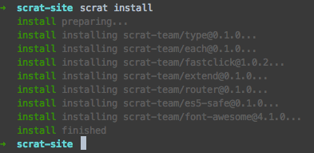

> scrat是基于 [fis](http://fis.baidu.com) 打造的集成解决方案，其命令行风格也基本保持一致。

## scrat release

> 项目构建命令，满足所有开发、构建、部署需求。

在项目目录下执行 ``scrat release`` 命令，即可对项目进行构建，并将构建结果发布到本地服务器调试目录


构建工具常见的功能就是区分构建目的，比如开发构建、测试构建、上线构建等。scrat并不像 [grunt](http://gruntjs.com) 或者 [gulp](http://gulpjs.com) 那样定义不同的task来区分构建目的，而是通过release命令的多种参数组合来确定构建目的。

scrat release 命令的所有参数可以通过 scrat release -h 命令来查看，其中常用的包括：

* ``--dest <paths>``：指定构建结果的发布路径。
* ``--md5``：是否给非模块化静态资源添加md5戳。
* ``--domains``：是否为静态资源添加域名。
* ``--lint``：是否开启代码校验。
* ``--optimize``：是否开启代码压缩
* ``--pack``：是否开启csssprite、combo合并。
* ``--watch``：是开启文件监听
* ``--live``：是否开启浏览器自动刷新
* ``--unique``：是否使用独立缓存(ci上构建时使用)

scrat release 命令的所有参加均可 ``自由组合``，不同参数的不同组合即可得到不同的开发状态，参数顺序没有影响。

## 工作方式


scrat ``绝对不会`` 修改用户的源代码，而是将源码处理后发布到另外一个目录下，这样可以对产出目录中的文件进行浏览或发布。因此scrat release其实始终需要 ``--dest <发布目录>``参数来制定发布目的地的。开发时为了方便起见，运行省略--dest参数，如果省略，代码会被发布到内置的调试服务器目录下，方便预览。

> 有些简易的构建工具会对源码直接进行浏览，其原理是服务器浏览的同时实时构建代码，这种方式``很矬``，相当于写了两套构建过程，非常不可取。

### 本地开发

> 无压缩优化 + 文件监听 + 自动刷新

本地开发常用的参数组合就是 ``--watch`` 和 ``--live`` 了，也就是文件监听+浏览器自动刷新：

```bash
scrat release --watch --live
```

添加--watch参数之后，命令行会hold住，保持命令窗口不要关闭，执行修改源码、保持，就能看到浏览器自动刷新。

--watch 和 --live 参数都有各自的缩短写法 ``-w`` 和 ``-L``(注意大小写)。因此上面的命令可以简写为：

```bash
scrat release -w -L
```

另外，命令行参数还能进一步 ``连写`` ，因此上述命令还能进一步简化为：

```bash
scrat release -wL
```

由于命令省略了 ``--dest <paths>`` 参数，因此scrat会把构建结果发送到默认的服务器目录，使用 ``scrat server open`` 命令可以查看该目录。


### 事实上

## scrat install

> 从GitHub安装生态组件，提升开发效率。



## scrat server &lt;cmd&gt;

> 启动nodejs服务器，无需环境依赖即可调试。

## scrat init

> 项目脚手架，快速创建新项目。

## 使用 ``-h`` 参数获取帮助

所有命令的基本用法及参数说明均可以通过 ``-h`` 参数获取。比如想查看scrat有哪些内置命令，则执行：

```bash
scrat -h
```

即可查看所有scrat内置的命令：

```bash
Usage: scrat <command>

Commands:

  release     build and deploy your project
  install     install component modules
  server      launch nodejs server
  init        init scrat project

Options:

  -h, --help     output usage information
  -v, --version  output the version number
  --no-color     disable colored output
```

想查看其中某个命令的参数，比如scrat release命令的参数，也可以继续使用 ``-h`` 参数：

```bash
scrat release -h
```

得到：

```bash
Usage: release [options]

Options:

  -h, --help             output usage information
  -d, --dest <names>     release output destination
  -m, --md5 [level]      md5 release option
  -D, --domains          add domain name
  -l, --lint             with lint
  -t, --test             with unit testing
  -o, --optimize         with optimizing
  -p, --pack             with package
  -w, --watch            monitor the changes of project
  -L, --live             automatically reload your browser
  -c, --clean            clean compile cache
  -r, --root <path>      set project root
  -f, --file <filename>  set fis-conf file
  -u, --unique           use unique compile caching
  --verbose              enable verbose output
```