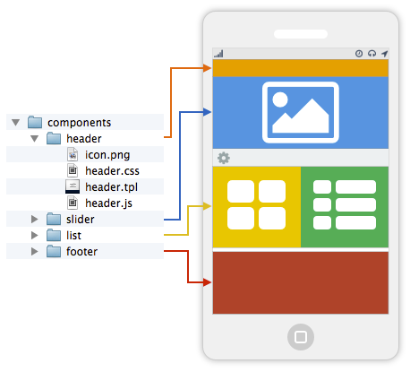
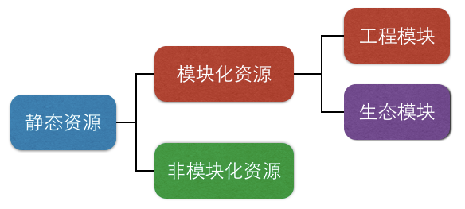

## 概念

> 工程师希望能像 ``搭积木`` 一样开发和维护系统，通过组装模块得到一个完整的系统。

在模块化系统的结构中，模块是可组合、可分解和更换的单元，这就要求模块本身具有一定的 ``独立性``，完整的前端模块化方案需要将js、css和模板维护在一起，保证模块的独立。



## 规范

静态资源分成两类—— ``模块化资源`` 和 ``非模块化资源`` 两类。其中模块化资源还分为 ``工程模块`` 和 ``生态模块`` 两类。



* ``模块化资源``：具有独立性的模块所对应的静态资源。每个独立的模块将自己所需要的js、css、模板、图片等资源放在一起维护，使得模块具备独立性，引用模块的js即可。
    * ``工程模块``：当前工程所开发的模块。这些模块通常跟业务耦合较高。
    * ``生态模块``：从 [模块生态](/#!/todo) 下载的模块，属于外部依赖。
* ``非模块化资源``：虽然在模块化开发体系内，应该 ``一切皆模块``，但总有不应该成为模块的资源，比如入口页面、reset.css等。

其目录规范为：

```bash
scrat-site
  ├─ component_modules (生态模块)
  ├─ components        (工程模块)
  ├─ views             (非模块化资源)
  ├─ ...
```

> 如果把所有资源都扔到 ``views`` 目录下，scrat也可以退化为传统的无模块前端项目，模块化与非模块化资源之间的平衡可以由开发者自己把握。

## 开发


## 引用

## 技巧